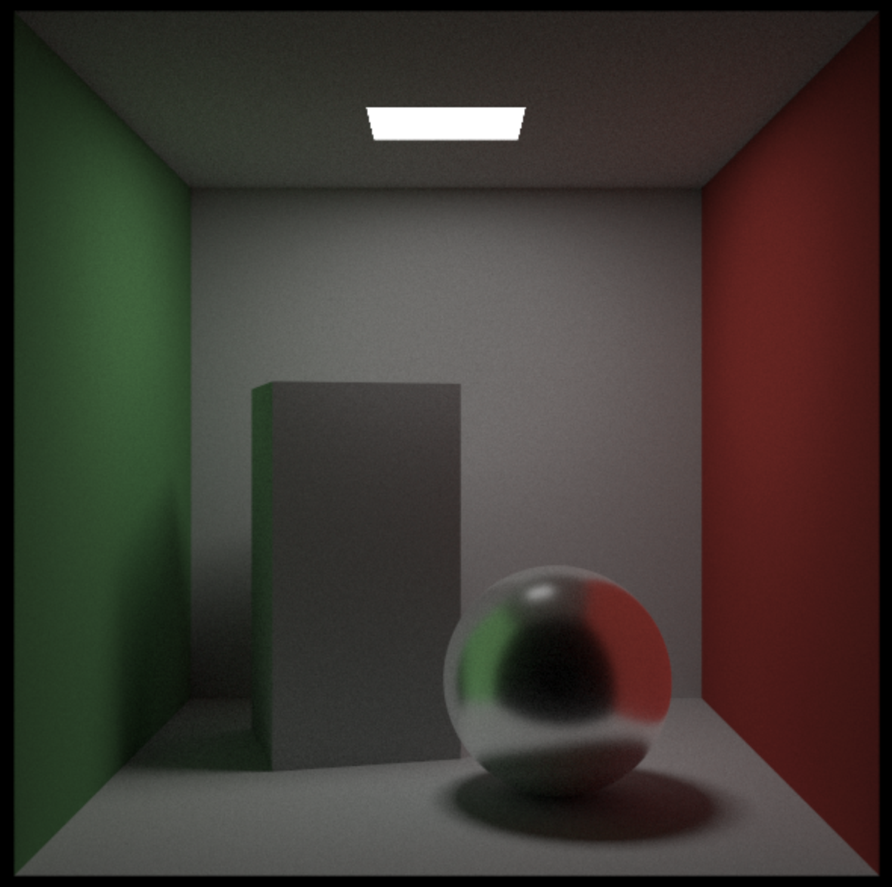
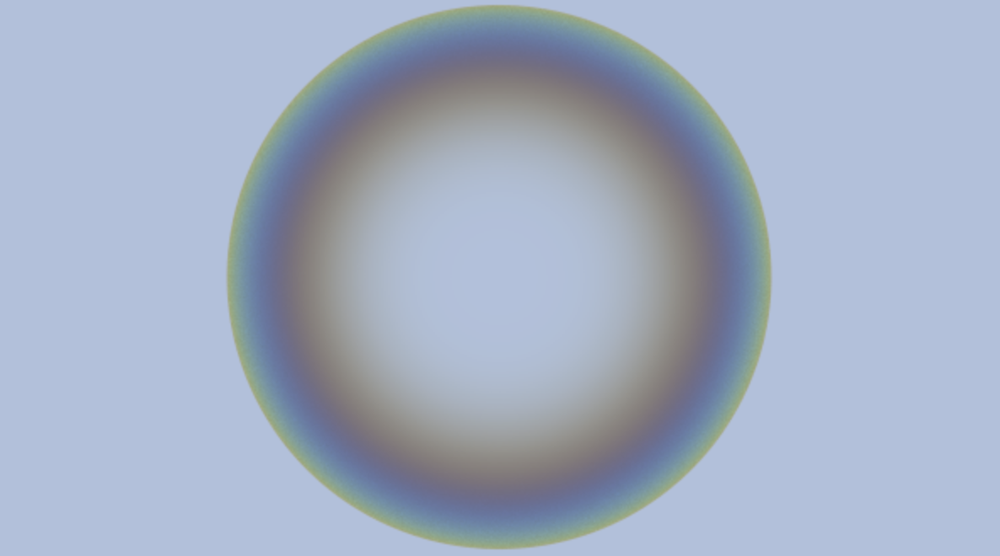

# Raytracer 2.0

A C++ raytracer implementation featuring physically-based rendering with Cook-Torrance BRDF, GGX microfacet distribution, and various material types.

## Screenshots

### Glossy Sphere (Cornell Box)


### Iridescent Bubble


## Building the Project

### Prerequisites
- CMake (version 3.10 or higher)
- C++17 compatible compiler

### Build Instructions
1. Create a build directory:
```bash
mkdir build
cd build
```

2. Generate build files:
```bash
cmake ..
```

3. Build the project:
```bash
make
```

4. Run the executable:
```bash
./Raytracer
```

The output will be saved as `image.ppm` in the `build/` directory.

## Viewing PPM Files on macOS

To view the generated PPM images on Mac, use `qlmanage`:

```bash
qlmanage -p build/image.ppm
```

Or simply double-click the `.ppm` file in Finder.

## Choosing Scenes

To render different scenes, edit the `switch` statement in `src/main.cpp` (around line 614). Change the number in `switch (4)` to one of the available scene numbers:

- **Case 4**: `bubble()` - Iridescent glass bubble
- **Case 8**: `cornell_box()` - Cornell box with glossy sphere
- **Case 11**: `estimate_pi()` - Monte Carlo pi estimation
- **Case 12**: `estimate_log_sin()` - Integration example
- **Case 13**: `estimate_log_sin_halfway_point()` - Integration with sorting
- **Case 14**: `integrate_cos_cubed()` - Cos cubed integration

Uncomment other cases in the switch statement to enable additional scenes:
- Case 1: Bouncing spheres
- Case 2: Checkered spheres
- Case 3: Earth texture
- Case 5: Perlin noise spheres
- Case 6: Simple light scene
- Case 7: Quads scene
- Case 9: Cornell box with smoke
- Case 10: OBJ model loader

## Project Structure
- `src/` - Source files
- `src/core/` - Core raytracer components (materials, camera, hittables, etc.)
- `images/` - Rendered output images
- `CMakeLists.txt` - CMake build configuration
